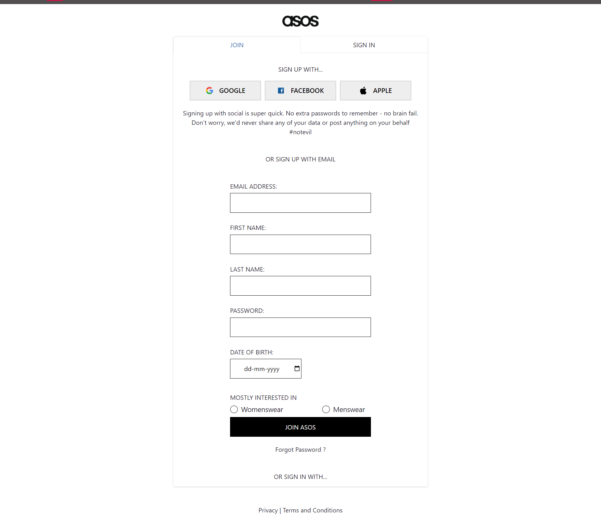
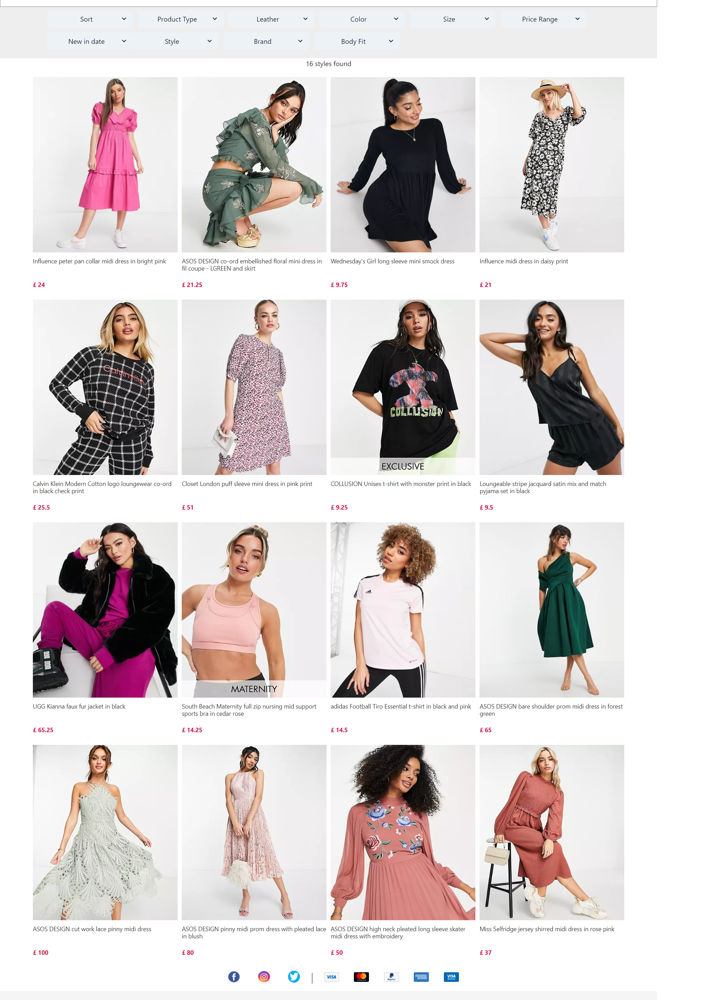
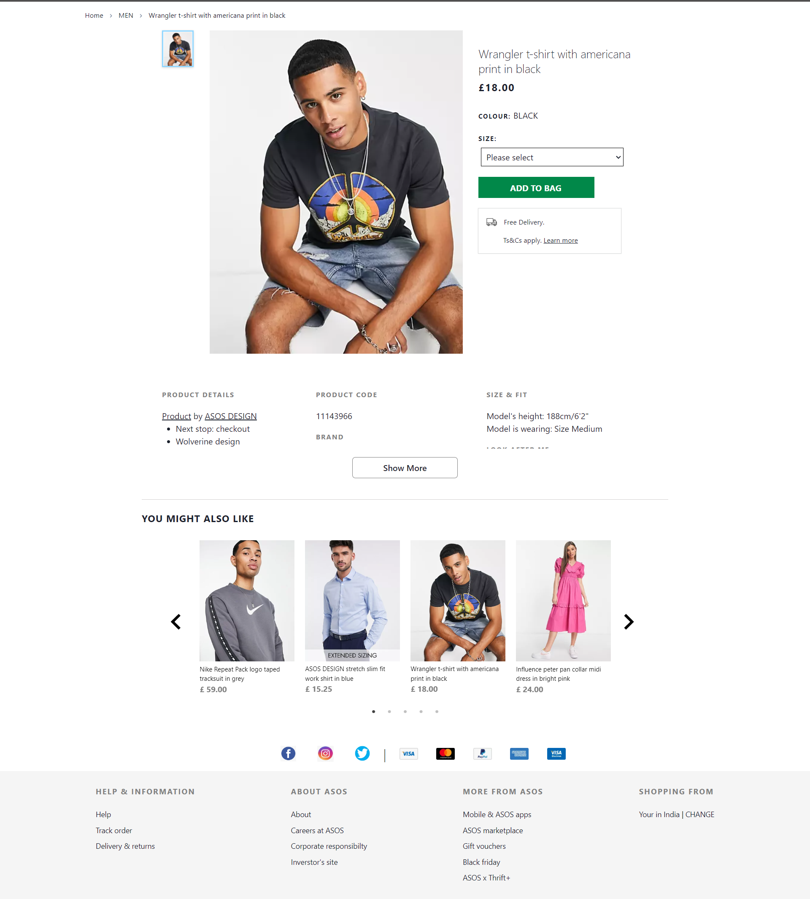
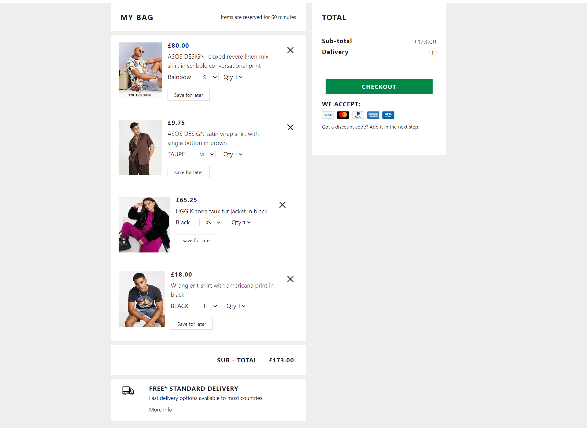
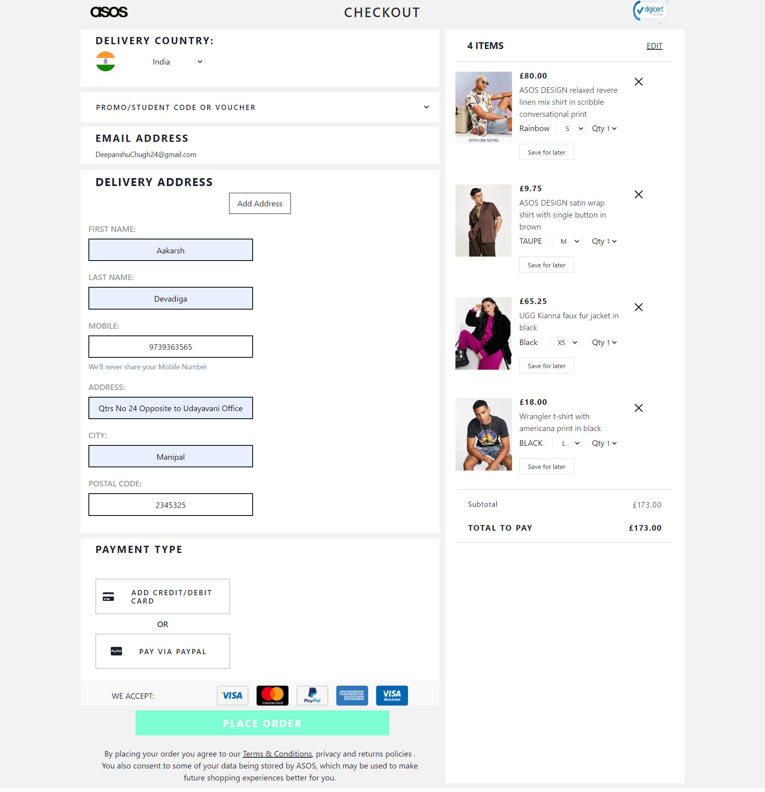
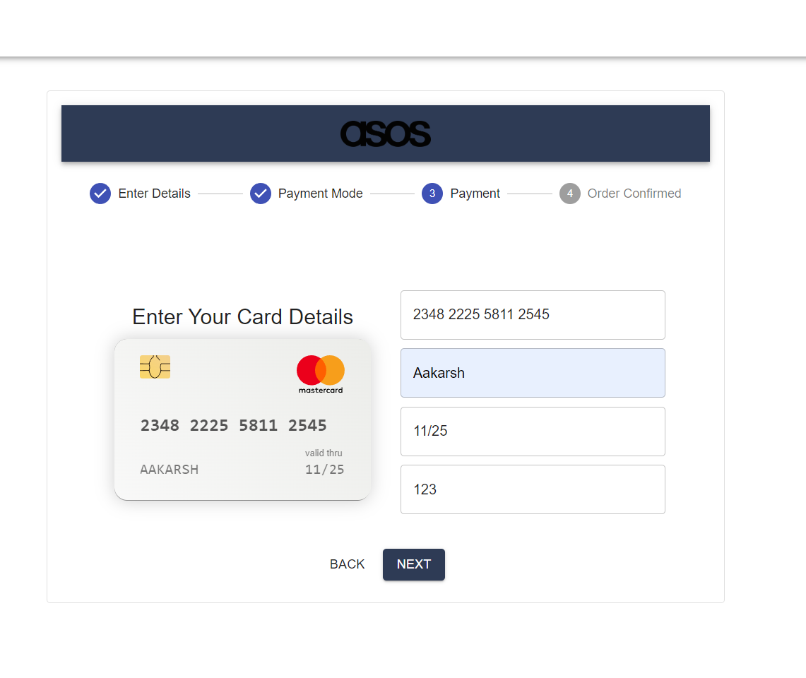

# ASOS

ASOS is a British online fashion and cosmetic retailer. The company was founded in 2000 in London, primarily aimed at young adults.

# ASOS CLone

This is the clone of ASOS website which we have done during our Unit 4 construct week at Masai. Its functional clone of the website. 
## Technologies used

- HTML
- Javascript
- CSS
- React
- Chakra UI
- Json Server

## Functional things

- User signup page and login page with form validation and data managed with  json server
- Home page
- 3 product pages with data managed with json server
- Sorting and Filtering functionality
- Cart Page with size & quantity updation
- Checkout page 
- Payment page with payment confirmation


## Run Locally

Pre-Requisite : 
VS Code

Clone the project

```bash
#   https://github.com/aakarsh604/Asos-Clone
#   run json server on local host on port 8080
```


## Website Flow

- Signup & Login pages by Rovin and Deepanshu


- Homepage, Men & Women pages by Aakarsh


- Product pages by Manish Singh


- Product Details & Cart pages by Saurav



-  Checkout and Payment pages by Deepanshu



## Authors

- [Aakarsh](https://github.com/aakarsh604)
- [Deepanshu Chug](https://github.com/DeepanshuChugh)
- [Saurav Samui](https://github.com/sauravsamui)
- [Manish Singh](https://github.com/ManishSingh64)
- [Rovin Singh](https://github.com/rovin-singh)
